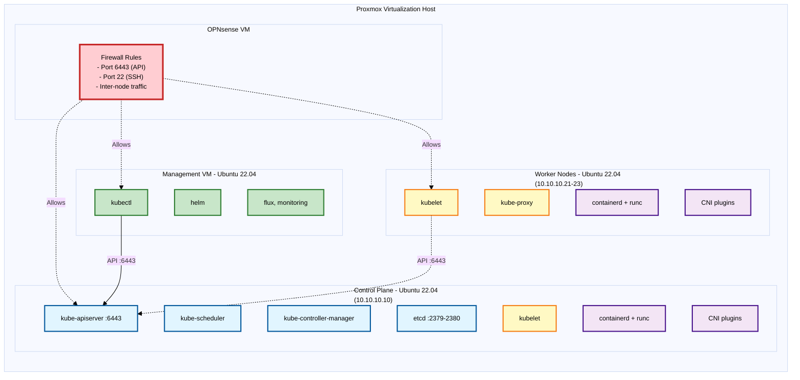

# Tutorial: Manual Kubernetes Cluster Installation (Production-Ready)

A comprehensive guide to manually installing a production-ready Kubernetes cluster using kubeadm with containerd as the container runtime. This tutorial provides complete control over the installation process and is suitable for learning Kubernetes internals or customized deployments.

## Learning Objectives

By the end of this tutorial you will:

- Understand the complete Kubernetes installation stack (containerd, runc, CNI, kubelet, kubeadm)
- Manually install and configure all components from official sources
- Configure systemd cgroups for optimal performance
- Bootstrap a production-ready cluster with kubeadm
- Configure kubectl with completion and aliases

## Prerequisites

- [ ] Three or more VMs (1 control plane, 2+ workers), Ubuntu 22.04 LTS
- [ ] Root or sudo access on all nodes
- [ ] 2 GB RAM minimum per node (4 GB recommended)
- [ ] 2 CPUs minimum per control plane node
- [ ] Network connectivity between all nodes
- [ ] Unique hostname, MAC address, and product_uuid for every node

## Architecture Overview



## Part 1 — System Prerequisites #all-nodes

- [x] Control Plane (10.10.10.10)
- [x] Worker Nodes (10.10.10.21-23)

Run these commands on every node (control plane and workers).

### 1.1 Disable Swap

Kubernetes requires swap to be disabled for kubelet to work properly.

```bash
# Disable swap immediately
sudo swapoff -a

# Disable swap permanently
sudo sed -i '/ swap / s/^/#/' /etc/fstab

# Verify swap is disabled
free -h
```

### 1.2 Configure Kernel Modules

Load required kernel modules for networking and container runtime.

```bash
# Create module configuration
cat <<EOF | sudo tee /etc/modules-load.d/k8s.conf
overlay
br_netfilter
EOF

# Load modules immediately
sudo modprobe overlay
sudo modprobe br_netfilter

# Verify modules are loaded
lsmod | grep -E "overlay|br_netfilter"
```

### 1.3 Configure sysctl for Networking

Enable IP forwarding and bridge netfilter for Kubernetes networking.

```bash
# Create sysctl configuration
cat <<EOF | sudo tee /etc/sysctl.d/k8s.conf
net.bridge.bridge-nf-call-iptables  = 1
net.bridge.bridge-nf-call-ip6tables = 1
net.ipv4.ip_forward                 = 1
EOF

# Apply sysctl parameters without reboot
sudo sysctl --system

# Verify configuration
sysctl net.bridge.bridge-nf-call-iptables net.ipv4.ip_forward
```

## Part 2 — Install Container Runtime Stack #all-nodes

- [x] Control Plane (10.10.10.10)
- [x] Worker Nodes (10.10.10.21-23)

### 2.1 Install containerd

Install containerd from GitHub releases for the latest stable version.

```bash
# Set version and architecture
CONTAINERD_VERSION="2.0.0"
ARCH="amd64"

# Download containerd
cd /tmp
wget https://github.com/containerd/containerd/releases/download/v${CONTAINERD_VERSION}/containerd-${CONTAINERD_VERSION}-linux-${ARCH}.tar.gz

# Verify download (optional but recommended)
wget https://github.com/containerd/containerd/releases/download/v${CONTAINERD_VERSION}/containerd-${CONTAINERD_VERSION}-linux-${ARCH}.tar.gz.sha256sum
sha256sum -c containerd-${CONTAINERD_VERSION}-linux-${ARCH}.tar.gz.sha256sum

# Extract to /usr/local
sudo tar Cxzvf /usr/local containerd-${CONTAINERD_VERSION}-linux-${ARCH}.tar.gz

# Install systemd service
sudo mkdir -p /usr/lib/systemd/system
sudo wget -O /usr/lib/systemd/system/containerd.service https://raw.githubusercontent.com/containerd/containerd/main/containerd.service

# Enable and start containerd
sudo systemctl daemon-reload
sudo systemctl enable --now containerd

# Verify containerd is running
sudo systemctl status containerd
```

### 2.2 Install runc

Install runc, the OCI runtime used by containerd.

```bash
# Set version
RUNC_VERSION="1.2.0"

# Download runc
wget https://github.com/opencontainers/runc/releases/download/v${RUNC_VERSION}/runc.amd64

# Install to system path
sudo install -m 755 runc.amd64 /usr/local/sbin/runc

# Verify installation
runc --version
```

### 2.3 Install CNI Plugins

Install Container Network Interface plugins required for pod networking.

```bash
# Set version and paths
CNI_PLUGINS_VERSION="v1.6.0"
ARCH="amd64"
CNI_DEST="/opt/cni/bin"

# Create CNI directory
sudo mkdir -p "$CNI_DEST"

# Download and extract CNI plugins
curl -L "https://github.com/containernetworking/plugins/releases/download/${CNI_PLUGINS_VERSION}/cni-plugins-linux-${ARCH}-${CNI_PLUGINS_VERSION}.tgz" | sudo tar -C "$CNI_DEST" -xz

# Verify installation
ls -la "$CNI_DEST"
```

### 2.4 Configure containerd with systemd cgroup

Generate default configuration and enable systemd cgroup driver for compatibility with kubelet.

```bash
# Create containerd config directory
sudo mkdir -p /etc/containerd

# Generate default configuration
sudo containerd config default | sudo tee /etc/containerd/config.toml

# Enable systemd cgroup driver
sudo sed -i 's/SystemdCgroup = false/SystemdCgroup = true/' /etc/containerd/config.toml

# Restart containerd to apply changes
sudo systemctl restart containerd

# Verify containerd is running with new config
sudo systemctl status containerd
```

### 2.5 Install crictl (Optional but Recommended)

crictl is a CLI for CRI-compatible container runtimes, useful for debugging.

```bash
# Set version
CRICTL_VERSION="v1.31.0"
ARCH="amd64"
DOWNLOAD_DIR="/usr/local/bin"

# Download and extract crictl
curl -L "https://github.com/kubernetes-sigs/cri-tools/releases/download/${CRICTL_VERSION}/crictl-${CRICTL_VERSION}-linux-${ARCH}.tar.gz" | sudo tar -C $DOWNLOAD_DIR -xz

# Verify installation
crictl --version

# Configure crictl to use containerd
cat <<EOF | sudo tee /etc/crictl.yaml
runtime-endpoint: unix:///run/containerd/containerd.sock
image-endpoint: unix:///run/containerd/containerd.sock
timeout: 10
EOF
```

## Part 3 — Install Kubernetes Components #all-nodes

- [x] Control Plane (10.10.10.10)
- [x] Worker Nodes (10.10.10.21-23)

### 3.1 Install kubeadm, kubelet, and kubectl

Install the three core Kubernetes binaries directly from official releases.

```bash
# Set paths
DOWNLOAD_DIR="/usr/local/bin"
ARCH="amd64"

# Get latest stable release version
RELEASE="$(curl -sSL https://dl.k8s.io/release/stable.txt)"
echo "Installing Kubernetes version: $RELEASE"

# Download kubeadm, kubelet, and kubectl
cd /tmp
sudo curl -L --remote-name-all https://dl.k8s.io/release/${RELEASE}/bin/linux/${ARCH}/{kubeadm,kubelet,kubectl}

# Make binaries executable and move to system path
sudo chmod +x {kubeadm,kubelet,kubectl}
sudo mv {kubeadm,kubelet,kubectl} $DOWNLOAD_DIR/

# Verify installations
kubeadm version
kubelet --version
kubectl version --client
```

### 3.2 Configure kubelet systemd Service

Install systemd service files for kubelet.

```bash
# Set release version for service files
RELEASE_VERSION="v0.16.2"
DOWNLOAD_DIR="/usr/local/bin"

# Install kubelet systemd service
curl -sSL "https://raw.githubusercontent.com/kubernetes/release/${RELEASE_VERSION}/cmd/krel/templates/latest/kubelet/kubelet.service" | sed "s:/usr/bin:${DOWNLOAD_DIR}:g" | sudo tee /usr/lib/systemd/system/kubelet.service

# Create kubelet service.d directory
sudo mkdir -p /usr/lib/systemd/system/kubelet.service.d

# Install kubeadm systemd drop-in
curl -sSL "https://raw.githubusercontent.com/kubernetes/release/${RELEASE_VERSION}/cmd/krel/templates/latest/kubeadm/10-kubeadm.conf" | sed "s:/usr/bin:${DOWNLOAD_DIR}:g" | sudo tee /usr/lib/systemd/system/kubelet.service.d/10-kubeadm.conf

# Enable kubelet (will start after kubeadm init/join)
sudo systemctl enable kubelet
```

### 3.3 Configure kubectl #control-plane #management-vm

- [x] Control Plane (10.10.10.10)
- [x] Management VM (optional)

Set up kubectl with bash completion and aliases for easier cluster management.

```bash
# Install bash completion
kubectl completion bash | sudo tee /etc/bash_completion.d/kubectl > /dev/null
sudo chmod a+r /etc/bash_completion.d/kubectl

# Add kubectl alias and completion
echo 'alias k=kubectl' >> ~/.bashrc
echo 'complete -o default -F __start_kubectl k' >> ~/.bashrc
# Replace '$USER with your actual username on the control plane
scp $USER@10.10.10.10:~/.kube/config ~/.kube/config

# Set proper ownership
chmod 600 ~/.kube/config

# Verify connection to cluster
kubectl get nodes
kubectl cluster-info
```

## Part 4 — Initialize Control Plane #control-plane

- [x] Control Plane (10.10.10.10)

### 4.1 Create kubeadm Configuration File

Create a configuration file for more control over cluster initialization.

```bash
# Create kubeadm config directory
sudo mkdir -p /etc/kubernetes

# Create kubeadm configuration file
cat <<EOF | sudo tee /etc/kubernetes/kubeadm-config.yaml
apiVersion: kubeadm.k8s.io/v1beta4
kind: ClusterConfiguration
kubernetesVersion: stable
controlPlaneEndpoint: "10.10.10.10:6443"
networking:
  podSubnet: "10.244.0.0/16"
  serviceSubnet: "10.96.0.0/12"
---
apiVersion: kubeadm.k8s.io/v1beta4
kind: InitConfiguration
nodeRegistration:
  criSocket: "unix:///run/containerd/containerd.sock"
  kubeletExtraArgs:
    - name: "cgroup-driver"
      value: "systemd"
EOF
```

### 4.2 Initialize the Cluster

```bash
# Initialize cluster using config file
sudo kubeadm init --config=/etc/kubernetes/kubeadm-config.yaml
```

```bash
# Configure kubectl for current user
mkdir -p $HOME/.kube
sudo cp -i /etc/kubernetes/admin.conf $HOME/.kube/config
sudo chown $(id -u):$(id -g) $HOME/.kube/config

# Verify control plane components
kubectl get nodes
kubectl get pods -n kube-system
```

**Important:** Save the `kubeadm join` command output - you'll need it to join worker nodes.

### 4.3 Install CNI Plugin - Flannel

Install a Container Network Interface plugin to enable pod networking.

```bash
# Install Flannel CNI
kubectl apply -f https://raw.githubusercontent.com/flannel-io/flannel/master/Documentation/kube-flannel.yml

# Wait for Flannel DaemonSet to be ready (optional - usually takes ~30 seconds)
kubectl rollout status daemonset/kube-flannel-ds -n kube-flannel --timeout=300s

# Verify CNI installation
kubectl get pods -n kube-flannel
kubectl get nodes
```

**Alternative CNI options:** Calico, Cilium, Weave Net (see official docs for installation).

## Part 5 — Join Worker Nodes #worker-nodes

- [x] Worker Nodes (10.10.10.21-23)

Run the `kubeadm join` command from the control plane initialization output on each worker node.

```bash
# Example join command (use actual token and hash from your init output)
sudo kubeadm join 10.10.10.10:6443 \
  --token <your-token> \
  --discovery-token-ca-cert-hash sha256:<your-hash>
```

**If you lost the join command:**

```bash
# On control plane, create new token
kubeadm token create --print-join-command
```

## Part 6 — Verification and Post-Installation #control-plane #management-vm

- [x] Control Plane (10.10.10.10)
- [ ] Management VM (optional)

### 6.1 Verify Cluster Status

```bash
# Check all nodes are Ready
kubectl get nodes

# Check all system pods are Running
kubectl get pods -A

# Check cluster info
kubectl cluster-info

# Detailed cluster info (optional)
kubectl cluster-info dump
```

### 6.2 Test Pod Deployment

```bash
# Create test deployment
kubectl create deployment nginx --image=nginx:alpine

# Expose deployment
kubectl expose deployment nginx --port=80 --type=NodePort

# Check deployment and verify pod is running on a worker node
kubectl get pods -o wide

# The NODE column should show a worker node (10.10.10.21, .22, or .23)
# Control plane has a taint by default that prevents pods from scheduling there

# Get service details
kubectl get svc nginx

# Capture the NodePort as a variable
NODE_PORT=$(kubectl get svc nginx -o jsonpath='{.spec.ports[0].nodePort}')
echo "NodePort: $NODE_PORT"

# Test access - use any node IP with the captured NodePort
# These curl commands work from control plane, workers, OR management VM
curl http://10.10.10.10:$NODE_PORT   # Control plane
curl http://10.10.10.21:$NODE_PORT   # Worker 1
curl http://10.10.10.22:$NODE_PORT   # Worker 2

# Expected output: nginx welcome page HTML

# Cleanup
kubectl delete deployment nginx
kubectl delete service nginx
```

## Troubleshooting

### Nodes Not Ready

```bash
# Check kubelet status
sudo systemctl status kubelet
sudo journalctl -u kubelet -f

# Check containerd status
sudo systemctl status containerd
sudo journalctl -u containerd -f

# Verify CNI pods are running
kubectl get pods -n kube-flannel
```

### Pods Not Starting

```bash
# Describe the pod
kubectl describe pod <pod-name>

# Check pod logs
kubectl logs <pod-name>

# Check containerd
sudo crictl ps -a
sudo crictl logs <container-id>
```

### Network Issues

```bash
# Verify CNI installation
ls -la /opt/cni/bin/

# Check pod CIDR configuration
kubectl get nodes -o jsonpath='{.items[*].spec.podCIDR}'

# Verify iptables rules
sudo iptables -L -t nat
```

## Production Considerations

### High Availability

For production, consider:

- Multiple control plane nodes (3 or 5 recommended)
- External etcd cluster
- Load balancer for API server

See: [Kubernetes HA Topology](https://kubernetes.io/docs/setup/production-environment/tools/kubeadm/ha-topology/)

### Security

- Configure RBAC authorization
- Enable audit logging
- Set up network policies
- Configure pod security standards
- Rotate certificates regularly

See: [Kubernetes Security Best Practices](https://kubernetes.io/docs/tasks/administer-cluster/securing-a-cluster/)

### Resource Management

- Set namespace resource quotas
- Configure limit ranges
- Enable horizontal pod autoscaling
- Monitor resource usage

See: [Manage Resources](https://kubernetes.io/docs/tasks/administer-cluster/manage-resources/)

## What's Next?

- [[Task - Deploy Your First Application]]
- Install Helm package manager
- Set up metrics-server for resource monitoring
- Configure persistent storage (CSI drivers)
- Set up Ingress controller
- Deploy monitoring stack (Prometheus/Grafana)

## References

- [Kubernetes Production Environment Setup](https://kubernetes.io/docs/setup/production-environment/)
- [Container Runtimes](https://kubernetes.io/docs/setup/production-environment/container-runtimes/)
- [Installing kubeadm](https://kubernetes.io/docs/setup/production-environment/tools/kubeadm/install-kubeadm/)
- [Creating a cluster with kubeadm](https://kubernetes.io/docs/setup/production-environment/tools/kubeadm/create-cluster-kubeadm/)

---

**Tutorial version:** 1.0  
**Last tested:** 2026-02-01 with Kubernetes 1.31  
**Verified on:** Ubuntu 22.04 LTS
odes
kubectl get pods -A

```

Expect the control plane and worker nodes to show `Ready`, and CNI pods to be `Running`.

## Troubleshooting

- If nodes remain `NotReady`, check `kubectl describe node <name>` and `journalctl -u kubelet -b`.
- If CNI pods are `CrashLoopBackOff`, inspect the pod logs and ensure `--pod-network-cidr` used for `kubeadm init` matches the CNI requirements.

## What's Next?

- Install Helm and a metrics stack from the management VM
- Add additional worker nodes or configure HA control plane

---

**Tutorial version:** 1.0
**Last tested:** 2026-02-01 with Kubernetes 1.28
```
