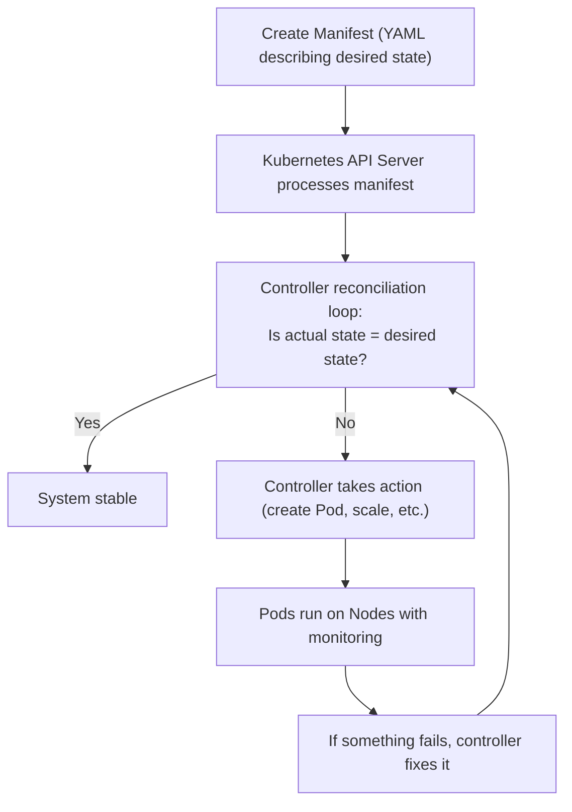

# Concept: What is Kubernetes?

_Answer: What is Kubernetes and why does it exist?_

## Definition

**Kubernetes** is an **orchestration platform** for running and managing containerized applications at scale. It automates deployment, scaling, and operation of containers across clusters of machines.

Think of it as an **automated operations manager** for your containers: you describe what you want to run, Kubernetes figures out how to run it, and keeps it running.

## Why It Matters

Before Kubernetes, you had to:
- Manually deploy containers to specific servers
- Handle failures (if a container crashed, restart it manually)
- Scale manually (add more servers, rebalance traffic)
- Manage networking between containers manually
- Monitor everything yourself

**Kubernetes automates all of this.** You declare your desired state (e.g., "I want 3 copies of my app running"), and Kubernetes continuously works to maintain that state—handling failures, scaling, networking, and more.

## Core Idea: Desired State

The fundamental concept in Kubernetes:

1. **You declare desired state:** "I want 3 copies of nginx:1.24"
2. **Kubernetes maintains that state:** Creates Pods, monitors them, replaces failures
3. **This is continuous:** Kubernetes constantly checks and fixes mismatches

This is called **reconciliation** and is the magic that makes Kubernetes work.

## What Kubernetes Manages

- **Containers:** Groups of containers (called [[Concept - Pods]])
- **Resources:** Memory, CPU, storage allocation
- **Networking:** How containers talk to each other and the outside world
- **Storage:** Persistent data
- **Scaling:** Automatically increasing/decreasing replicas
- **Updates:** Rolling out new versions without downtime
- **Failures:** Restarting crashed containers, replacing failed nodes
- **Secrets & configs:** Managing sensitive data and configuration

## Key Kubernetes Objects

| Object | Purpose |
|---|---|
| **Pod** | Smallest unit; wraps container(s) |
| **Deployment** | Describes desired state for Pods (e.g., 3 replicas) |
| **Service** | Stable endpoint for accessing Pods (load balancing) |
| **Namespace** | Logical partition within a cluster |
| **Node** | A machine running Pods |
| **Volume** | Storage that Pods use |

## How It Works: The Big Picture

## Key Concepts You'll Encounter

### **Cluster**
A set of machines (Nodes) running Kubernetes. Think of it as the entire system.

### **Control Plane**
The "brain" of Kubernetes. Makes decisions, schedules Pods, manages state. Runs on special control-plane nodes.

### **Node**
A machine (physical or virtual) that runs Pods. Managed by the control plane.

### **Pod**
The smallest thing Kubernetes runs. Usually one container, but can be multiple containers sharing networking.

### **Deployment**
How you describe what you want to run: "3 replicas of my app, using this image, with this update strategy."

### **Service**
How you expose your Pods to the outside world or to other Pods. Provides stable DNS name and load balancing.

## Common Misconceptions

### Myth: Kubernetes is a container runtime

**Reality:** Kubernetes doesn't run containers directly. It orchestrates containers that are run by container runtimes (Docker, containerd, etc.). Kubernetes tells the runtime what to do.

### Myth: You need Kubernetes to run containers

**Reality:** You can run containers without Kubernetes (using Docker directly). Kubernetes is for **managing many containers at scale**. Use it when you need orchestration.

### Myth: Kubernetes replaces Docker

**Reality:** Docker and Kubernetes solve different problems. Docker packages applications. Kubernetes runs and scales those packages. They work together.

### Myth: Kubernetes is the same as Docker Swarm

**Reality:** Both orchestrate containers, but Kubernetes is more powerful and complex. It's the industry standard.

## Why Kubernetes Matters

If you're running more than a handful of containers, Kubernetes saves you:
- **Time:** Automation instead of manual operations
- **Reliability:** Self-healing, automatic restarts
- **Scalability:** Scale to thousands of containers easily
- **Efficiency:** Pack containers efficiently on available resources
- **Portability:** Run on any cloud or on-premises

## Your Next Steps

- [[Task - Deploy Your First Application]] (practical: run something)
- [[Concept - Pods]] (understand the smallest unit)
- [[Concept - Architecture Overview]] (understand how it all fits together)

## Related Concepts

- [[Concept - Pods]] — The smallest deployable unit
- [[Concept - Deployments]] — How you declare desired state
- [[Concept - Services]] — How you expose applications
- [[Concept - Architecture Overview]] — Complete system overview

---

**Quick summary:** Kubernetes is an automated manager for containers. You say "I want 3 copies of this app running", Kubernetes makes it happen and keeps it running. That's the core idea.
